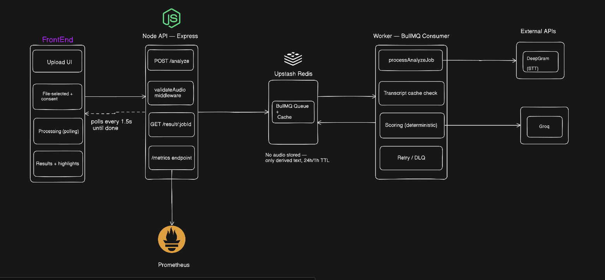

# Livo — Architecture & Design Decisions

**Live app:** https://livo-assestment.vercel.app
**API:** https://livo-server-production.up.railway.app
**Repo:** [link to GitHub repo]

---

## 1. System overview




The app is a **queue-based async pipeline**, deliberately split into three independently deployable pieces so that a single slow request (transcription + LLM feedback can take 5–15s) never blocks the HTTP layer:

1. **Frontend (Next.js, Vercel)** — handles upload, client-side pre-validation, and polls for results.
2. **API (Express, Railway)** — validates the upload server-side, enqueues a job, returns immediately (`202 Accepted`). Never touches Deepgram or Groq directly.
3. **Worker (BullMQ consumer, Railway, separate service)** — pulls jobs from the queue, runs STT → scoring → LLM feedback, writes the result back to Redis.

The API and worker communicate only through **Upstash Redis** (BullMQ's job queue), not directly with each other. This means either can be redeployed, scaled, or restarted independently.

### Request flow
```
Browser → POST /analyze → API validates (format, duration) → enqueues job → 202 { jobId }
Worker picks up job → Deepgram (transcribe) → scoring (confidence threshold)
                     → Groq (generate feedback) → result cached in Redis
Browser polls GET /result/:jobId every 1.5s → returns { status, progress } until "completed"
```

---

## 2. Components and why each was chosen

| Layer | Choice | Why over alternatives |
|---|---|---|
| Backend host | Railway (2 services: web + worker) | Needed native support for a long-running worker process alongside a web service — serverless platforms (Vercel Edge, plain Lambda) can't hold the persistent BullMQ connection a worker needs. Started on Render; migrated to Railway when Render's background workers required a paid plan (see §5). |
| Queue | BullMQ + Upstash Redis | The core architectural fit for slow, external-API-bound work: gives retry/backoff for free, decouples the HTTP-facing tier from the processing tier, and Upstash's serverless Redis needs no infrastructure management. |
| STT | Deepgram (Nova-3) | Managed API avoids self-hosting a PyTorch/Wav2Vec2 model, which would exceed free-tier RAM limits and add cold-start risk to the single most important grading criterion — does it work when opened. Nova-3 chosen over Nova-2 for better default accuracy at the same pricing tier. |
| LLM feedback | Groq (Llama 3.3 70B) | Fast inference, used **only** to translate flagged words/confidence scores into readable coaching text — never as the source of the score itself. Keeps scoring deterministic and explainable. |
| Scoring | Confidence-threshold flagging on STT word-level output | Pragmatic V1 approach — see §3 for full reasoning and its known limitation. |
| Caching | Content-hash-keyed Redis cache (two-tier — see §5) | Avoids duplicate paid API calls on retries and identical re-uploads. |
| Frontend | Next.js + Tailwind + shadcn/ui | Fast path to a public URL with no server setup on the client side; component structure maps cleanly to the app's four states (upload → file selected → processing → results). |

**Deliberately not used:** Kafka (wrong scale for a single-tenant assessment app — named here as the "what I'd use at higher scale" answer, not implemented), self-hosted forced-alignment models, full Prometheus+Grafana deployment (a lightweight `/metrics` endpoint is exposed instead, in Prometheus text format, ready to be scraped by a real Grafana instance in production).

---

## 3. Scoring & highlighting methodology

Each word from Deepgram's transcription carries a confidence score (0–1). Words below a **0.75 threshold** are flagged as "needs practice." The overall score is the average confidence across all words, scaled to 0–100.

This is a heuristic, not a calibrated model — the threshold wasn't tuned against a labeled dataset. A proper calibration path would use **L2-ARCTIC** (a labeled L2-English pronunciation corpus) to set thresholds empirically rather than by inspection. This was explicitly out of scope for a 5-day solo build, and the assignment brief states scoring accuracy itself isn't graded.

**A real limitation found during testing, worth stating directly:** confidence-based flagging catches *uncertain* transcription, but not *confident mis-transcription*. In testing, the word "Worcestershire" was transcribed as two entirely different, fluent-sounding words ("Rakesh Thar") — one of which Deepgram was highly confident about (0.91) and therefore did **not** flag, despite being completely wrong. A word can be pronounced unclearly enough to produce a wrong-but-fluent alternative that the STT model is confident about. True pronunciation accuracy would require comparing against a known reference script (forced alignment against expected text), which this assignment doesn't provide — flagged here as the clearest "what I'd build next" item.

---

## 4. DPDP compliance (India's Digital Personal Data Protection Act, 2023)

- **No persistent storage of audio.** Uploaded audio is held in memory (via multer's memory storage, never written to disk) for the duration of one processing job, then discarded. This is the core compliance argument: with no persistence, most retention/residency/deletion obligations are satisfied by design rather than by policy.
- **Explicit consent.** The upload flow requires a checked consent box ("I consent to this audio being processed for pronunciation scoring only") before the analyze button is enabled — enforced in the UI, not just documented.
- **Purpose limitation.** Audio and derived data are used only to generate the pronunciation report — never for model training or any secondary purpose.
- **Short-lived derived data.** The transcript/score/feedback (not the audio) are cached in Redis for cost/idempotency reasons, with explicit TTLs: 24 hours for full results, 1 hour for intermediate transcripts (see §5). This is a deliberate, bounded exception to "nothing persists," and is documented here rather than left implicit.
- **Data residency.** Deepgram and Groq process audio/text on their own infrastructure (US-based, per their public documentation) — not India-based. This is named as a known constraint of using managed international APIs rather than self-hosted models, and would be the first thing revisited for a production India-market deployment.
- **Right to deletion.** Since nothing persists beyond the job lifecycle and cache TTLs, this is satisfied by the architecture itself rather than requiring a separate deletion mechanism.

---

## 5. Reliability: retries, dead-letter handling, and a real pivot during testing

Jobs are configured with **3 attempts and exponential backoff** (5s → 10s → 20s) via BullMQ's native retry support. A job that exhausts all attempts is not silently dropped — it remains visible in BullMQ's failed-jobs list (`removeOnFail: false`), which functions as the dead-letter queue, and the frontend surfaces this as a clear "processing failed" state with the attempt count, rather than an infinite poll.

**A genuine issue found and fixed during testing, not just a hypothetical trade-off:** the original design cached only the *final* result, written after all three pipeline steps (STT → scoring → LLM feedback) succeeded. During testing with a deliberately broken Groq API key, logs showed that every one of the 3 retry attempts re-called Deepgram from scratch — a successful, paid STT call was being redundantly repeated purely because a downstream step failed. This was fixed by adding a **second, shorter-lived cache** (1-hour TTL) that stores the transcript immediately after a successful Deepgram call, checked independently on every retry before re-calling STT. Post-fix, a Groq-only failure retries only the Groq step, not the whole pipeline. This is exactly the kind of gap that's easy to miss when designing retry logic on paper and only becomes visible under real failure testing.

**A second real issue, also worth naming honestly:** the `/result/:jobId` polling endpoint intermittently returned `{ status: "completed", result: null }` during production testing — a race condition where `getState()` reported "completed" (a live check) while `job.returnvalue` was read from an earlier, stale in-memory snapshot of the job taken microseconds before the result was actually written. Fixed by re-fetching the job fresh from Redis after confirming completed state, before reading `returnvalue`. Left as-is, this would have occasionally crashed the frontend on a blank screen with no explanation — a good example of a bug that only surfaces under real network timing, not local testing.

---

## 6. Trade-offs and what I'd build next

- **Self-hosted forced-alignment scoring (MFA / torchaudio wav2vec2)** instead of confidence-threshold flagging — would catch the "confident mis-transcription" gap described in §3, at the cost of needing a known reference script and more infrastructure.
- **L2-ARCTIC-calibrated thresholds** instead of a heuristic 0.75 cutoff.
- **Step-level idempotency was retrofitted, not designed in from day one** — see §5. A production version would design the caching layer around individual pipeline stages from the start rather than the whole job.
- **Full Prometheus + Grafana deployment** — scoped out as disproportionate for this assessment; the `/metrics` endpoint is deliberately Prometheus-compatible so it's a drop-in scrape target, not a rebuild, if this were productionized.
- **Ogg/Opus audio from browser `MediaRecorder` APIs isn't reliably duration-validated** by the current library (`music-metadata`) — WAV/MP3/M4A/WebM are explicitly supported; Ogg/Opus would need either a more robust container-sniffing library or a lightweight ffprobe-based fallback.
- **No resume-after-refresh** — refreshing mid-processing resets the frontend to the upload screen rather than resuming the poll against the in-flight job. The job itself isn't lost (it's still processing server-side), just the frontend's connection to watching it.
- **CORS is currently scoped to the single known Vercel origin** rather than left open — a small but deliberate production-mindedness choice made after initial testing.